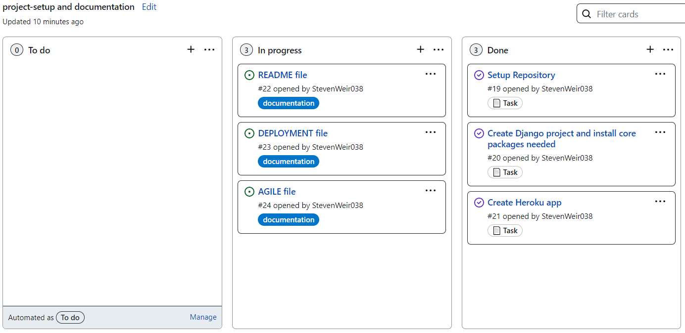
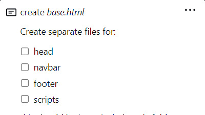
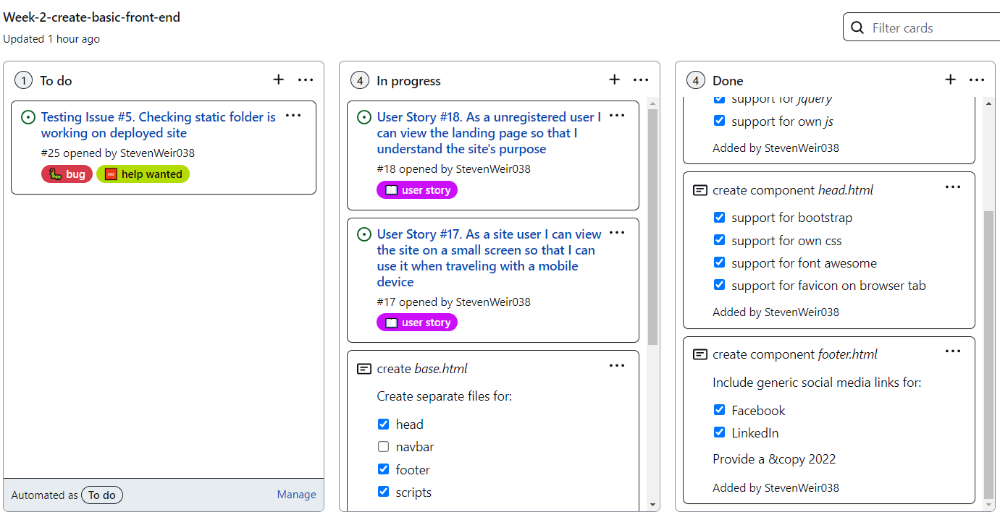
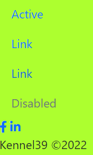
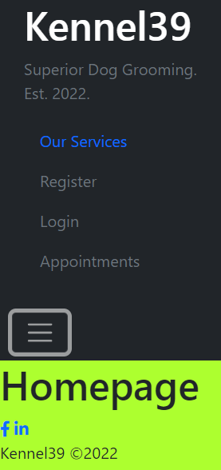
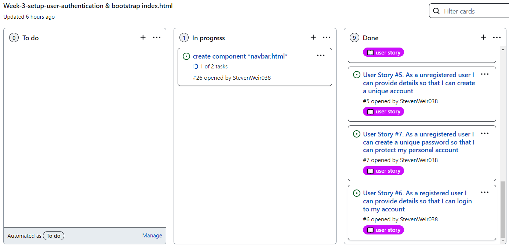
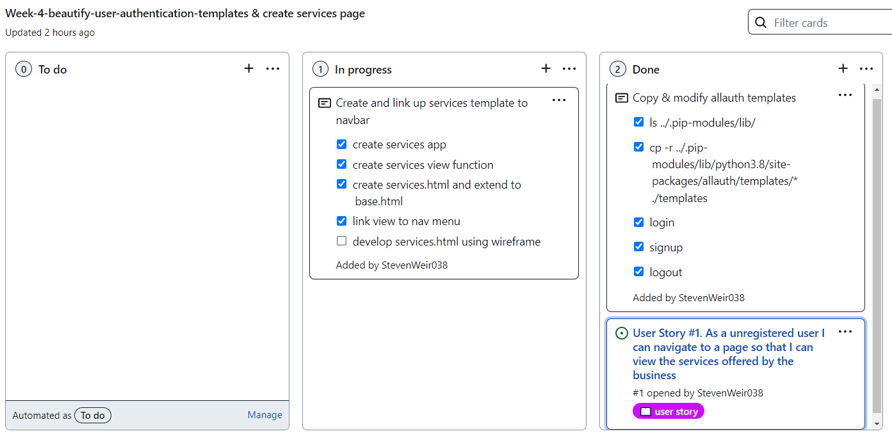

# Agile

## Sprint 1
- Setup repo
- Create Django project
- Install basic dependancies and add to requirements
- Create procfile to deploy to Heroku
- Create app on Heroku
- Link GitHub repo to Heroku app
- Test to deploy working project ASAP

- Document project creation and deployment
- Perform design thinking exercise for features to include in project
- Add user stories to readme
- Add wireframes to readme
- Identify a colour schema to use in the site
- Mock up initial database design and document in readme
- List and link technologies used in readme

- Learn to use Github projects. Create user stories and drop onto kanban board

### Reflections

Several false starts.
Got more comfortable using an Agile tool to plan functionality.  Applied retrospectively to 1st week objectives to practice how it works.

This was effectively the first iteration for the project before any real coding took place.

In a way I'll already started categorising user stories by area such as navigation or account management.  This gives an idea to the separate apps what will need to be created.

I found I was jumping from one task to the next with no real direction.  Best to plan each future iteration to make it easier to track what still needs to be done.

## Sprint 2
- Setup base.html
- create separate components for site such as head, navbar, scripts and footer in a subfolder to inject into base.html
- Setup index page in home app
- Build navigation

### Reflections

This week I focused on building out part of the frontend.  The `home` app will contain the index page for the site.
The templates folder in the root directory contains the base.html *et al* templates.  From what I've learned so far different webpage components should be injected into each template.  Follow a modular/reusable/extension approach.  

In the background I continued researching models as I want to try to get these right 1st time.

Also it's useful to have some templates to link to models via views when the time comes.

TWIL (This week I learned) after creating a new project, cards can be dragged across from the add card area.  Also helps to use checkboxes to tick off smaller tasks relating to a larger one.

Use bootstrap for speed.  Copy their [code](https://getbootstrap.com/docs/5.0/components/navs-tabs/) rather than start from scratch.

Start to tailor the bootstrap code to something more site specific.

With a basic navbar in place, this will have to be updated as new views/respective templates are created to deliver user story functionality.

*Register*, *Login* and *Appointments* in the menu have been purposefully disabled for now.

Update - change navbar to an offcanvas type.  Closer to wireframe design.  

Update - use 5 list items in menu, home, our services, register, login, Book Appointment.

Focus on finishing the landing page and creating an *Our Services* page. Link up as necessary.

Update - leave homepage bare bones. Can change the aesthetics toward the tail end of the project.

Removed User Story #17 from week 2 project - As a site user I can view the site on a small screen so that I can use it when traveling with a mobile

Removed User Story #18 from week 2 project - As a unregistered user I can view the landing page so that I understand the site's purpose

Technically services are a different function.  Time for a new *services* app!  #18 can drop into a future project week.  I feel it's best to get authenication working next as this affects the navbar.  Next logical step to complete that.

Fixed [issue #5](https://github.com/StevenWeir038/Kennel39/projects/2#card-78901276) to wrap up this week.

## Sprint 3
- Install `allauth` package
- Add allauth to installed applications in settings.py
- Add login/logout redirects back to index page
- Perform migrations
- Adapt navigation bar using Django Templates to to give registered/unregistered site users different menu options

- develop the landing page a little more using bootstrap. Aim to get the hero image to display correctly. Use its FSF approach to develop the frontend faster.

### Reflections
This week it wanted to focus on user accounts and authentication as that alters the navbar options through use of django templates.
Also, I realised I had to revise my use of Bootstrap as much of this knowledge hasn't been used in a few months.  By developing a generic landing page using Bootstrap I can speed up the creation of future templates.  Bespoke css/js/jquery can be added at a later time for a less derivative site.

Seven user stories satisfied this week.

## Sprint 4
- Copy & modify Allauth templates
- Extend Allauth user model
- Build Services page

### Reflections
This week I wanted to take the allauth package and style it to suit myu website.  Much of the instructed can from the relevant CI unit presented by Matt Rudge.  Towards the later part of the week I want to extend the alluth user class to suit my project.
A second outcome was getting comfortable wiring up a new page/template with Django.  The template must be set up correctly in a directory which must then be rendered by the view.  That view must then be referenced in the app url which in turn is referenced in the main project folder urls file.  In future I must remember to add the app to the installed apps list in main/settings.py!

1 unfixed [bug](https://github.com/StevenWeir038/Kennel39/issues/27) were the carousel image resizes when transitioning despite being of similar/size dimension to other images.  It produces an unwanted jumping effect.  Come back to this as I really need to makle a start on models.

Allauth sped up development of an authentication system for the site.  However a few extra custom fields were desired for the project including user `address` and `contact number`.  As I already performed migrations I choose not to extend the AbstractUser model.  Rather I created a new model with a one-to-one relationship to the existing User Model through a OneToOneField.  This was suitable as the extra information was desirable but not related to the authentication process.  Note, a bit of extra work will likely be needed to display the custom model but its a safer overall option. Still to resolve [bug](https://github.com/StevenWeir038/Kennel39/issues/28).

## Sprint 5
- Create bookings app, view and templates
- Link booking template to nav menu and homepage link buttons
- Show `Book Now` button only if user is logged in
- Create services model
- Create calendar model
- Become familiarised with creating records in Django admin.
- Addressed Postgres database bug which prevented service and booking tables working correctly.

### Reflections
I went into a bit less detail this week on template creation and links for bookings.  No need as the process is becoming more familiar.

There's not much in the way of crossing off user stories this week.  We are very much in the architecture stage or just getting things to work.

When naming classes to create models, use a singular name.  For example I created a `Services` model which shows up on the Django as `Servicess`.
Minor but annoying.  I redid my migrations as I can be pedantic with naming.
Take future care, be careful to synonymously reference my code for easier reading and debugging.

When re-reading the assignment brief, I started to think how my models affected site features.  The original `booking` model was too simple. To make business sense:

- Appointments were to be restricted to 8am-5pm business hours, not in the middle of the night!
- Appointment times should be standardised to specific time and duration.  Ie. 45 minutes each hour starting from 8am to 4pm.  A 9 hour day with 15 minute downtime between appointments (This will prevent appointment overlaps and the logic to do this must be supplied to the view)

Considering the above, the booking model **will** have to be updated.  First thoughts are to separate the booking time (date/time) to date and hour fields where the hour field can only be selected from a subclassed appointment list.

This has a downside. It isn't possible to use the `timedelta` method on the booking model to add an end time for an appointment.  It only works on `datetime` and not `time` datatype.

The calendar model in the ERD isn't required.  It's a pointless replication with hindsight so keep it simple.  A calendar is a way to display database objects so I can create one using a library such as `calendar.py` or take a premade one from a useful site such as [Colorlib](https://colorlib.com/wp/template/calendar-20/).  Event logic is still required.  A bit of Jquery on individual calendar elements can trigger events as needed...

Or do I simply display daily appointments as a list in a django template.  This would be simplier.

Final thought of the week.  You can follow instructions to the letter.  Things you assume will work because you are told don't always.  To be a better developer, assume nothing.

## Sprint 6
- 
- 

### Reflections
