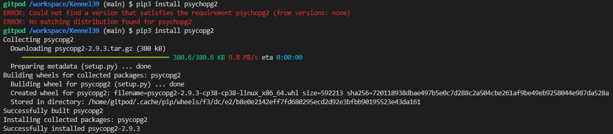
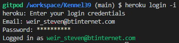
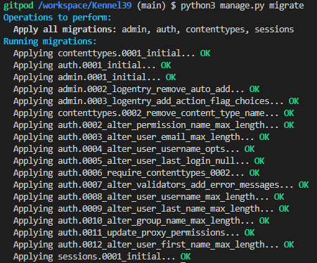

# Deployment

This project was a first attempt at deploying to *Heroku* and was done as early as possible to avoid undue stress closer to the submission deadline.

Full disclosure, it took a few iterations to get it working and was a little muddled.  A great deal was learned from the process.

It is assumed the user knows how to create a repository on Github.
The linked repo template from the [Code Institute](https://github.com/Code-Institute-Org/gitpod-full-template) was used to start the project.

To create a deployed a skeleton application on *Heroku* using Github/Gitpod IDE the folowing steps were observed:

1. Install Django 3.2 (LTS) with required packages
2. Create a new Django project
3. Set up project to use a relational database (PostgreSQL) and Cloudinary (for persistent file storage)
4. Deploy empty project to Heroku

## Install Django 3.2 (LTS) with required packages.

*Django*, a full stack framework will support this project.

To install, type *pip3 install Django==3.2* into the Gitpod terminal.


Install gunicorn (web server) by typing *pip3 install gunicorn*.


Install the dj_database_url library for postgreSQL by typing *pip3 install dj_database_url*, then install the psycopg2 library for postgreSQL by typing *pip3 install psycopg2*.




Install Cloudinary by typing *pip3 install dj3-cloudinary-storage*. 


Now create a requirements.txt file in the main directory. 

In the terminal, type *pip3 freeze --local > requirements.txt*.  This file tells Heroku what packages are needed to run the deployed application.  Follow this step each time a new package is installed in Gitpod.


## Create a new Django project.

To create a new *project* called *main* type the following to the terminal, `django-admin startproject main .`
This will create new folder called `main` and a `manage.py` file in the root directory. (First deployment I called main *django_kennel* or *kennel39*. Bottom line, create the new project first.


Now create an app called `home` within the project. Type *python3 manage.py startapp home* (NB. Project apps should be differentiated by functionality. This app will act as the homepage. First runtrhough I used *accounts* instead of home.


Open the `settings.py` file in the `main` **project** folder and add the newly created *home* app to the bottom of the Installed Apps list.  Remember to add a comma to the end even though it's the last list entry. First attempt I used *accounts*. Use *home* instead.


In the terminal, type *python3 manage.py migrate* to update the database schema used by Django.  


In the terminal, type *python3 manage.py runserver* to verify local deployment.  A message to open a page in the browser pops up using *port 8000*.

If Gitpod has a glitch and doesn't provide this popup, copy the url in the browser then paste into a new tab.  Add *8000-*. immediately after *https://*.


## Set up project to use a relational database (PostgreSQL) and Cloudinary (for persistent file storage)

Assuming the Heroku cli has been [installed](https://devcenter.heroku.com/articles/heroku-cli#download-and-install), a new Heroku project can be created using the terminal.

Type *heroku login -i* then provide your email and password.



Type *heroku apps:create main --region eu* to create a new heroku app called the-kennel (if you live in the EU).


A `Procfile` is needed in the main directory to tell Heroku the commands that are to be executed by the app on startup.  In this case we need to start a web server (gunicorn).

In the terminal, type *git add Procfile*.

Open the Procfile and type *web: gunicorn main.wsgi:application*. Save the file.

Commit those changes and push to GitHub using *git commit -m "Add procfile"* then enter; *git push* then enter.


In the projects `settings.py` file, add the name of the deployed apps name to *ALLOWED_HOSTS*.  In this case *'kennel39.herokuapp.com', 'localhost'*. Include localhost to run locally.


On your browser log into [Heroku](https://id.heroku.com/login) and navigate to your personal area.  Select the project just created to take you to the project's dashboard.


Select *Open app* to view the deployed project in a new browser tab.  If successful you will see the following.


With the deployed project working, it is time to:

- create and wire up a *PostgreSQL* database
- adapt the env settings/config vars
- setup *Cloudinary* for persistent file storage


### Postgres

Go to *Resources* in the project dashboard and type *postgres* into the addons textbox. Select *Heroku Postgres*.

Select the *Hobby Dev - Free* plan and then *Submit Order Form* on the modal.


Go to *Settings* in the project dashboard and select *Reveal Config Vars* in the *Config Vars* section.


Copy the value string for DATABASE_URL.

Back in the main directory in Gitpod, create a new file named `env.py`. This will contain confidential information so ensure it is listed in the `.gitignore` file to prevent public visibility.


In `env.py` import the os and setup environment variables including:

```python
import os

os.environ["DATABASE_URL"] = "postgres://<PASTED KEY FROM HEROKU>"
os.environ["SECRET_KEY"] = "SecretKeyOfYourChoice"
```

Add the SECRET key to Config vars in Heroku.


To reference the content of the `env.py` file in `settings.py`, under `from pathlib import Path` (ln #13) type

```python
import os
import dj_database_url
if os.path.isfile('env.py'):
    import env
```

Whilst in `settings.py`, change the insecure SECRET_KEY to reference the env variable set up in `env.py`.

```python
# SECRET_KEY = 'django-insecure-@-blahblahblah='
SECRET_KEY = os.environ.get('SECRET_KEY')
```

Now change the DATABASES_URL setting as follows:

```python
# Database
# https://docs.djangoproject.com/en/3.2/ref/settings/#databases

# DATABASES = {
#     'default': {
#         'ENGINE': 'django.db.backends.sqlite3',
#         'NAME': BASE_DIR / 'db.sqlite3',
#     }
# }

DATABASES_URL = {
    'default': dj_database_url.parse(os.environ.get('DATABASE_URL'))
}
```

In plain English, the above is a dictionary telling us the default database is the postgres database we referenced in `env.py`.  The dj_database utility is passing the url directly using the parse method.

To confirm the Heroku database is acting as the backend, perform migrations again by typing *python3 manage.py migrate*.



Selecting *Heroku Postgres* from *Resources* in Heroku will open a new browser tab showing it is available and contains 10 tables as below.


### Cloudinary

Create a [Cloudinary](https://cloudinary.com/) account.

On the cloudinary dashboard, copy the API environment variable.


At the bottom of `env.py` type the following:

```python
os.environ["CLOUDINARY_URL"] = "cloudinary://blahblahblah"
```

were *blahblahblah* equals the cloudinary key value.

Return to Heroku, Settings, Config Vars and add the key and value as well as the DISABLE_COLLECTSTATIC key and value to get the application working as currently there are now static files.


Add *cloudinary_storage* and *cloudinary* libraries to INSTALLED _APPS in `settings.py` to reflect below.

```python
INSTALLED_APPS = [
    'django.contrib.admin',
    'django.contrib.auth',
    'django.contrib.contenttypes',
    'django.contrib.sessions',
    'django.contrib.messages',
    'cloudinary_storage',
    'django.contrib.staticfiles',
    'cloudinary'
    'home',
]
```

To instruct Django to use Cloudinary to store media (images) and static files (css/javascript) add the following in `settings.py` below `STATIC_URL = '/static/'` (ln #132)

```python
STATICFILES_STORAGE = 'cloudinary_storage.storage.StaticHashedCloudinaryStorage'
STATICFILES_DIRS = [os.path.join(BASE_DIR, 'static')]
STATIC_ROOT = os.path.join(BASE_DIR, 'staticfiles')

MEDIA_URL = '/media/'
DEFAULT_FILE_STORAGE = 'cloudinary_storage.storage.MediaCloudinaryStorage'
```

To tell Django were to store templates add the following in `settngs.py` below `BASE_DIR = Path(__file__).resolve().parent.parent` (ln #20)

```python
TEMPLATES_DIR = os.path.join(BASE_DIR, 'templates')
```

Then set the DIRS key in TEMPLATES to the TEMPLATES_DIR value (ln #62)

```python
TEMPLATES = [
    {
        'BACKEND': 'django.template.backends.django.DjangoTemplates',
        'DIRS': [TEMPLATES_DIR],
...
```

Create 3 new top level directories for static, media and templates folders.

In the main directory, type the following into the command line: (mkdir = make directory <name>)


All changes that are committed and pushed from Gitpod IDE are stored on the Github repository and not the deployed Heroku side.  Is is possisble to push changes seperately to each platorm but it is easier to link GitHub to Heroku and have the latter automatically update from changes pushed to the repository.

To do so, in Heroku go to *Deploy*, select the *Connect to GitHub* button in the *Deployment Method* section.

Then type the GitHub repository name and *Connect*.


In the *Manual deploy* section select the *Deploy Branch* button.


Allow the deployed app to build then select *Open app* once complete.  You should see the same success screen as with the local deployment success except this time is has a different url.


Return to [README.md](README.md)