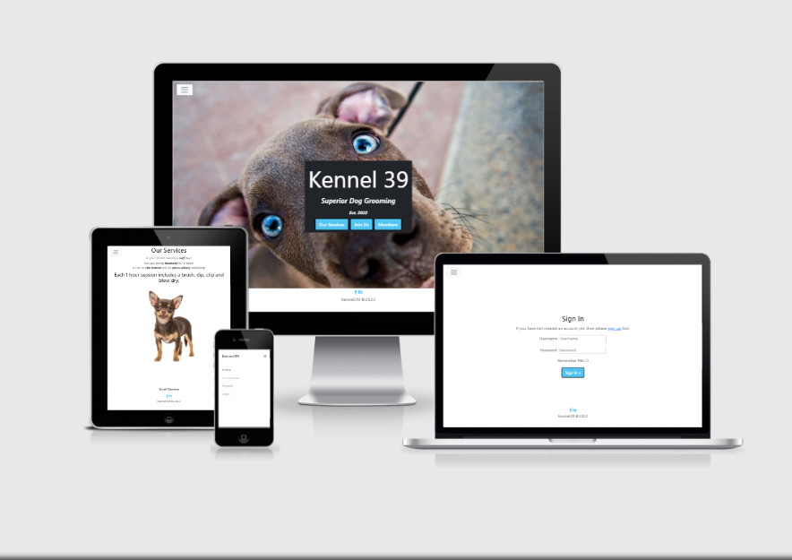
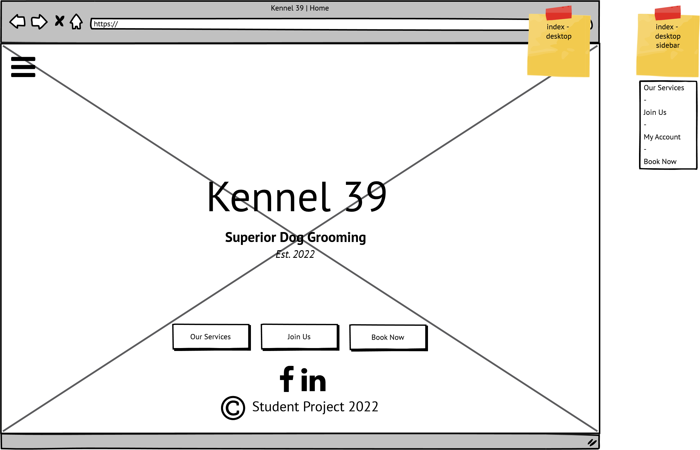
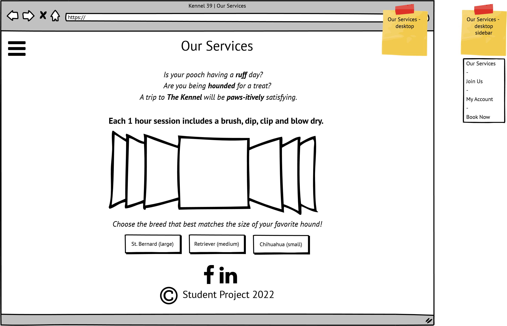
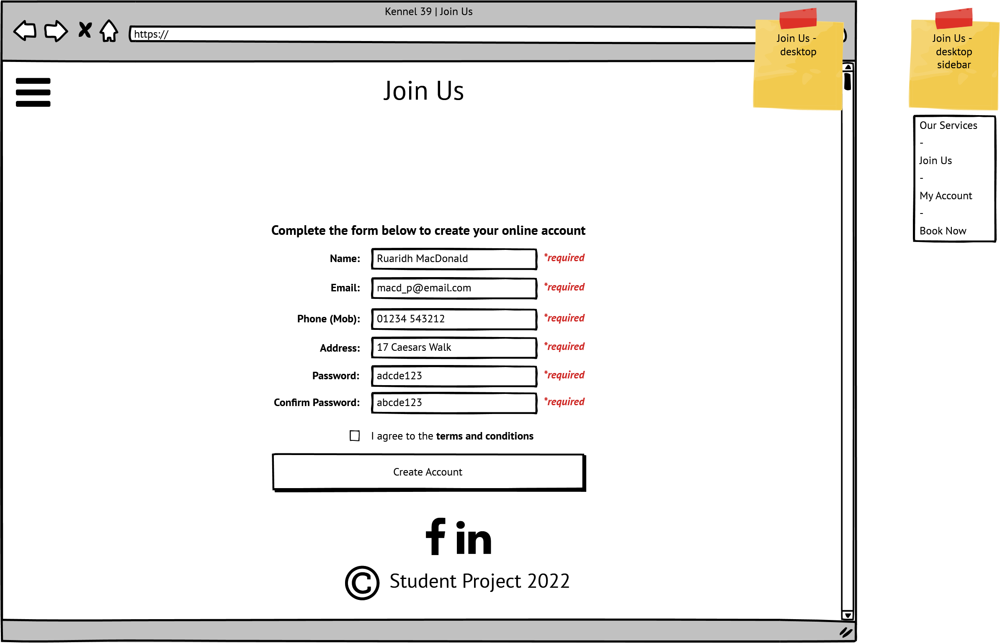
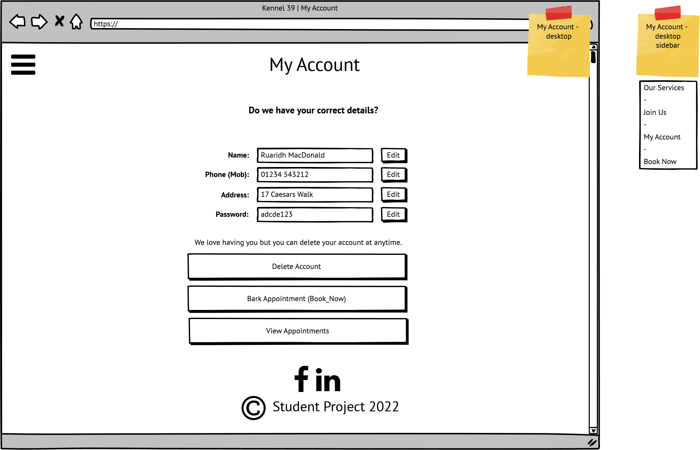
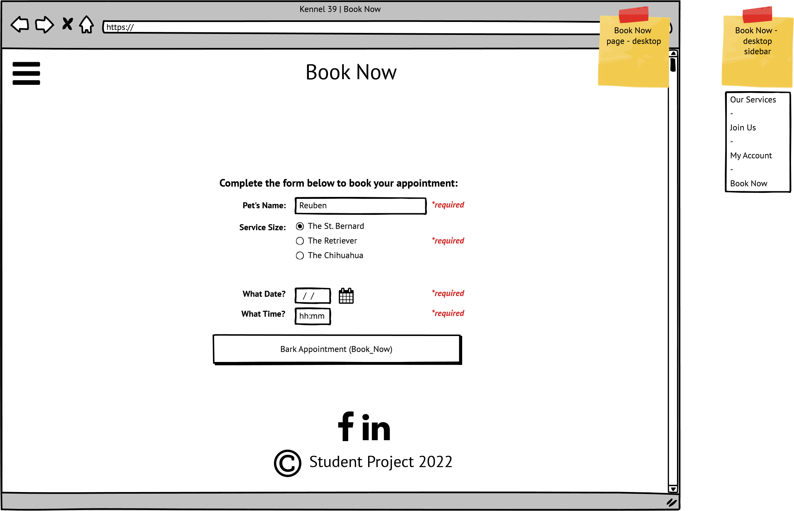
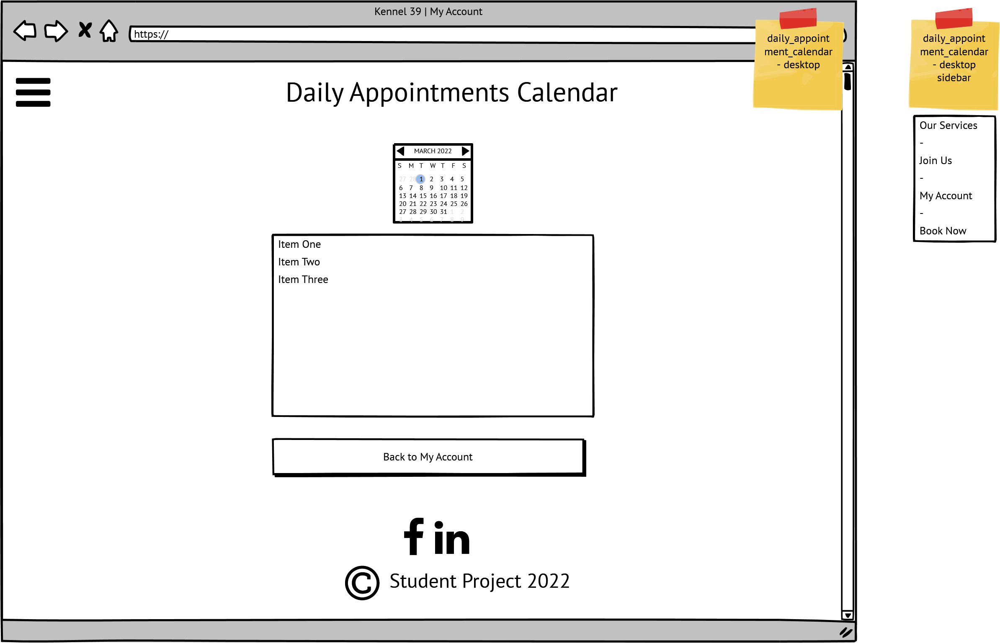
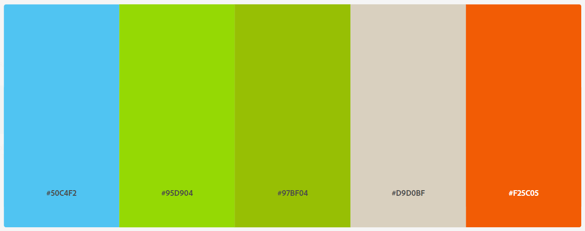
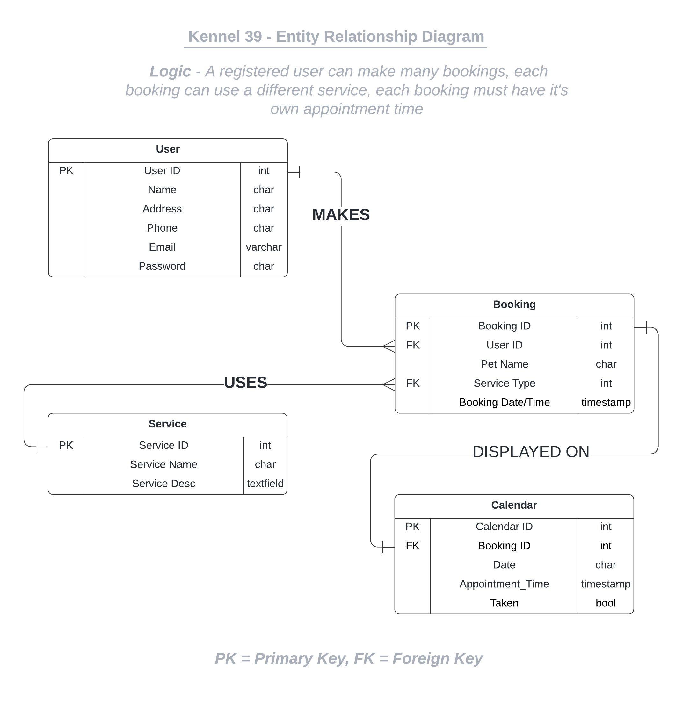

# Kennel39

Welcome to Kennel 39!  A  booking site for a small dog grooming business.

Click [here](https://kennel39.herokuapp.com/) to view the live site.

**TODO** - create mockup for deployed website using [Am I Responsive](http://ami.responsivedesign.is/).

eg. 

## Scenario

A business tends to perform better with a steady stream of customers. It can accept walk ins and/or utilise some sort of appointment booking system.  At its simplest, this could be using a phone with a handwritten diary to record client names and their booking times.

Consider *Kennel39*, a small startup business (albeit fictional) whose only employee is its sole trader/owner.
Phone calls to book appointments can occur at anytime during business hours. Such calls can be difficult to take when lathering shampoo into someone's favourite pooch.

One solution is to increase automation.  It could be more convenient for the business to have customers book an appointment using a webform. This method has the advantage that appointments can also be made outside standard working hours.  In theory, this increases accessibility to business services thus improving productivity and turnover.

Another valid concern is that some people prefer to book a service passively using the web as opposed to making a phonecall, especially those of a shy disposition or from a younger generation as they are accustomed to this way of working.

Finally, a business with a professionally developed website tends to do better than its peers.  This is because new and existing customers gain a better insight of ethos, facilities and services on offer.  Confidence equals engagement.

With the above in mind, let's build a site to help The Kennel!

## Design Thinking

Applying a *Design Thinking* approach, what *features* would users find most useful on the developed site?  How feasible is it for an inexperienced student developer to deliver prioritised features given the time constraints of a hard deadline?

As per assessment criteria, this project must utilise CRUD functionality.  This provides a broad outline of what is needed.  A brief though shower offered the following:

| Feature                                 | Importance | Feasability |
|:----------------------------------------|:----------:|:-----------:|
| View available services                 | 4          | 5           |
| Create personal account                 | 5          | 5           |
| Update account information              | 5          | 5           |
| Able to cancel account                  | 5          | 5           |
| Make an appoinment                      | 5          | 5           |
| Review latest appointment date/time     | 3          | 4           |
| Able to change/cancel an appointment    | 3          | 4           |
| Send client booking detail via email    | 2          | 4           |
| View history of all appointments made   | 2          | 3           |
| View costs of previous appointments     | 2          | 1           |
| Owner has calendar view of daily clients| 4          | 3           |
| **Overall Score**                       | **40**     | **44**      |

The above exercise indicates that overall importance/feasability scores were similar.  Therefore the project should be deliverable.

## User Stories

Following an *Agile* paradigm, *user stories* will target customer needs and reduce embelishments on the part of the developer.  These non technical statements will aid with the incremental changes needed to build the application.

Site user needs have been arbitrarily split into 4 categories:

- navigation
- account management
- bookings management
- other

NAVIGATION

- **As a** unregistered user, **I can** navigate to a page **so that** I can view the services offered by the business

- **As a** unregistered user, **I can** follow a link **so that** I can view the Kennel's social media content

- **As a** unregistered user, **I can** use a sidenav **so that** I can navigate the site on all views

- **As a** user, **I can** select a link **so that** I can register/ log in to my account

ACCOUNT MANAGEMENT

- **As a** unregistered user, **I can** provide details **so that** I can create a unique account

- **As a** registered user, **I can** provide details **so that** I can login to my account

- **As a** unregistered user, **I can** create a unique password **so that** I can protect my personal account

- **As a** logged in user, **I can** view a page **so that** I can see my personal account details by individual field 

- **As a** logged in user, **I can** click a button **so that** I can change my personal account details by individual field 

- **As a** logged in user, **I can** click a button **so that** I can delete my account

- **As a** logged in user, **I can** request an email **so that** I can reset my account password if I have forgotten it

BOOKINGS MANAGEMENT

- **As a** logged in user, **I can** provide booking details **so that** I can set up appointment

- **As a** logged in user, **I can** update details **so that** I can reschedule an appointment with the Kennel

- **As a** logged in user, **I can** cancel an appointment **so that** I can cancel an appointment with the Kennel

- **As a** logged in user, **I can** request an email **so that** be reminded of an appointment

- **As a** employee, **I can** view a page **so that** I can see my daily bookings or the current day

OTHER

- **As a** user, **I can** view the site on a small screen **so that** I can use it when traveling with a mobile device

- **As a** unregistered user, **I can** view the landing page **so that** I understand the site's purpose

Use of [Agile](AGILE.md) can be found in a separate file.

## Wireframes

Several wireframes were created to target user requirements. This provided an overall feel of the project before starting to code. Some alterations will likely take place as the project develops.

## Colour Schema

The colour schema was selected from [Adobe Color](https://color.adobe.com/search?q=dog).

The developed site should appear bright to contrast with the negative space.

In keeping with the dog theme, colours are based of the *Mystery Machine* as seen in [Scooby-Doo](https://en.wikipedia.org/wiki/Scooby-Doo).

## Database Design

Entity Relationship Diagrams help to visualise database architecture before creating models in Django.  Understanding the relationships between different tables can save time recoding later in the project.  Fortunately this system is quite simple so only 4 tables are required.

## Deployment

The site has been deployed early.  More dependancies may be added at a later time.

This process has been documented separately in [DEPLOYMENT.md](DEPLOYMENT.md)

## Testing

Refer to [TESTING.md](TESTING.md) for details on manual and automated testing.

## Technologies Used

- [Balsamiq](https://balsamiq.com/)
- [Lucidchart](https://lucid.co/)
- [Adobe Color](https://color.adobe.com/)
- [GitHub](https://github.com/)
- [Heroku](https://id.heroku.com/)
- HTML
- CSS
- Python
- [Bootstrap](https://getbootstrap.com/)
- [JQuery](https://jquery.com/) 
- [Django](https://www.djangoproject.com/)
- [PostgreSQL](https://www.postgresql.org/)
- [Cloudinary](https://cloudinary.com/)

## Credits

- Favicon by [Icons8](https://icons8.com/icons/set/favicon-dog)
- Facebook and LinkedIn icons by [Font Awesome](https://fontawesome.com/search?s=solid%2Cbrands)
- Inspiration for navbar design from [Vandelay Design](https://www.vandelaydesign.com/inspirationalnavigation-menus/)
- Landing page image from [Wallpaper Access](https://wallpaperaccess.com/blue-dog#google_vignette)