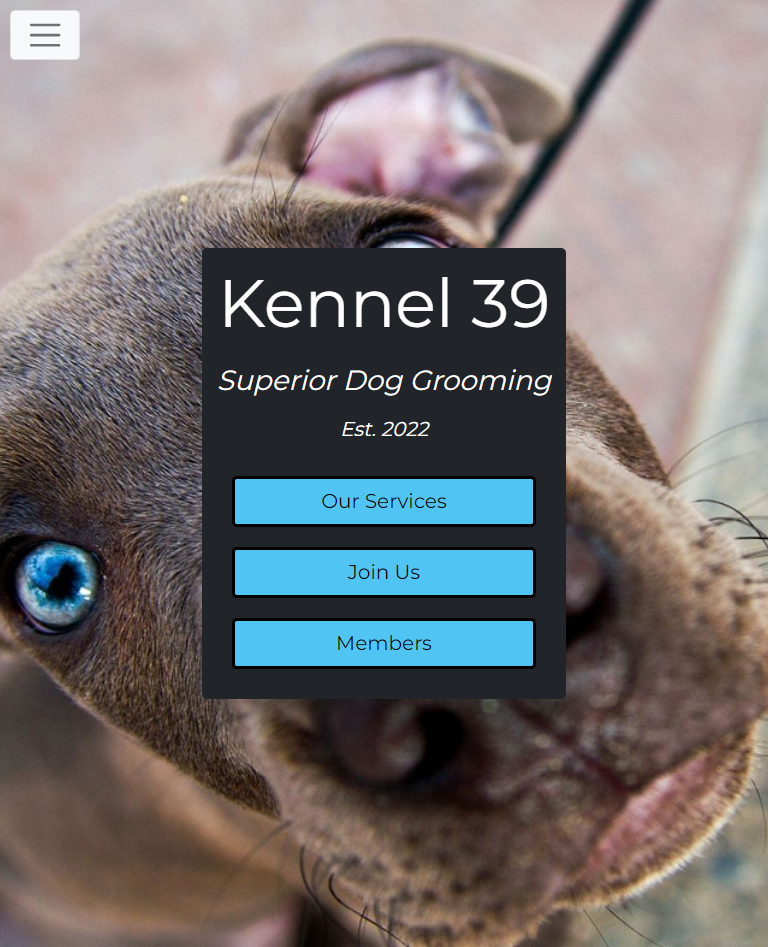
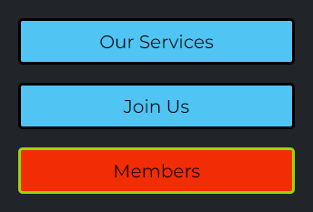
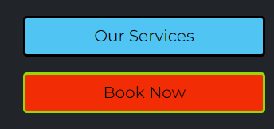
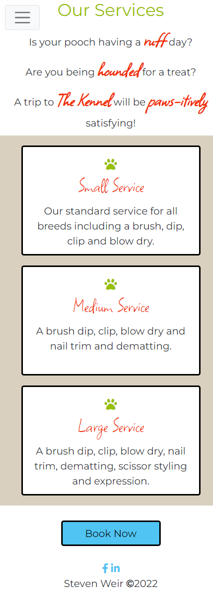
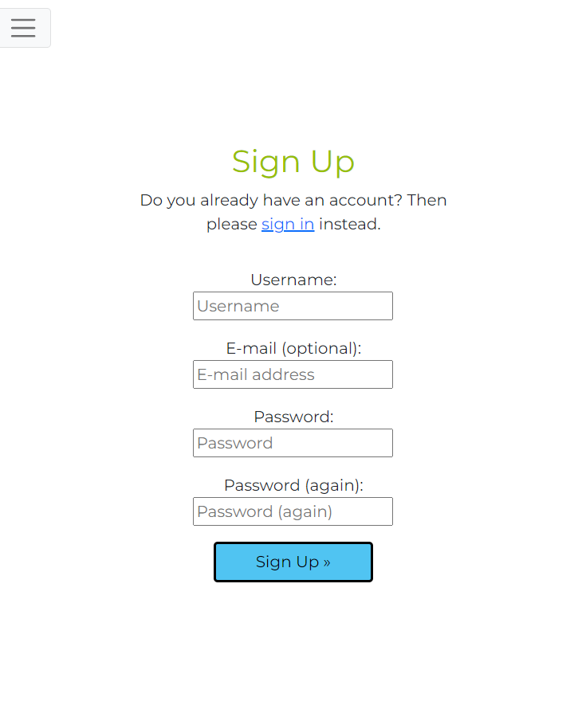
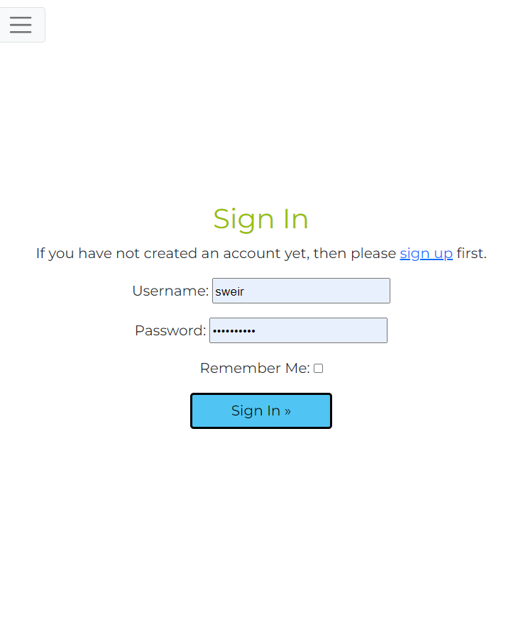
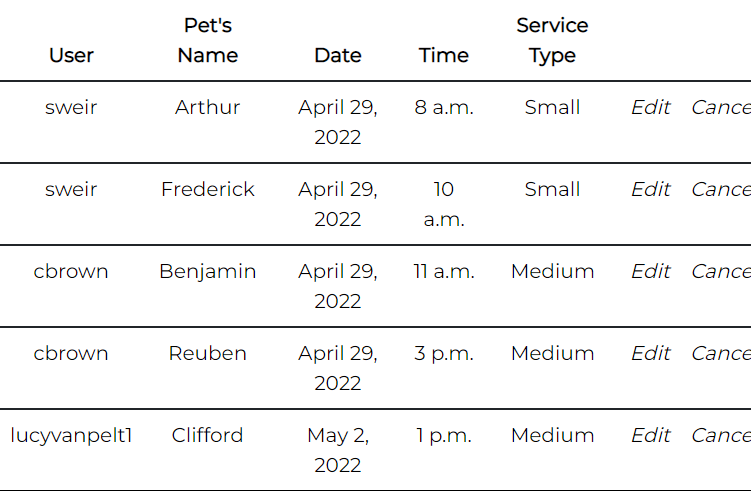
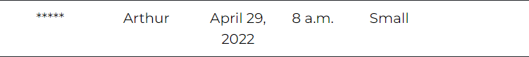
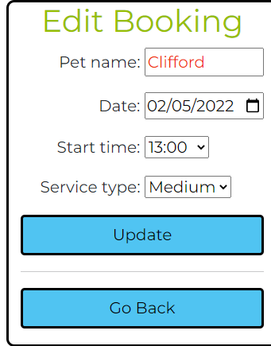
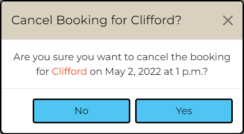

# Kennel39

Welcome to Kennel 39!  A  booking site for a small dog grooming business.

Click [here](https://kennel39.herokuapp.com/) to view the live site.

## Scenario

A business tends to perform better with a steady stream of customers. It can accept walk ins and/or utilise some sort of appointment booking system.  At its simplest, this could be using a phone with a handwritten diary to record client names and their booking times.

Consider *Kennel39*, a hypothetical startup business whose only employee is its sole trader/owner.
Phone calls to book appointments can occur at anytime during business hours. Such calls can be inconvenient when lathering shampoo into someone's pet.

It could help the business if customers book an appointment using a webform. This method has the advantage that appointments can also be made outside standard working hours.  In theory, this increases accessibility to business thus improving productivity and turnover.

Another valid concern is that some people prefer to book a service passively using the web as opposed to making a phonecall, especially those of a shy disposition or from a younger generation as they are accustomed to this way of working.

A business with a well developed website tends to do better than its peers.  Customers can gain a better insight of its ethos, facilities and services on offer.  In theory this fosters confidence and leads to greater engagement.

With the above in mind, let's build a site to help The Kennel!

## Design Thinking

Applying a *Design Thinking* approach, what *features* would users find most useful on the developed site?  How feasible is it for an inexperienced student developer to deliver prioritised features given the time constraints of a hard deadline?

As per assessment criteria, this project must utilise CRUD functionality.  This provides a broad outline of what is needed.  A brief though shower offered the following:

| Feature                                 | Importance | Feasability |
|:----------------------------------------|:----------:|:-----------:|
| View available services                 | 4          | 5           |
| Create personal account                 | 5          | 5           |
| Update account information              | 5          | 5           |
| Able to cancel account                  | 5          | 5           |
| Make an appoinment                      | 5          | 5           |
| Review latest appointment date/time     | 3          | 4           |
| Able to change/cancel an appointment    | 3          | 4           |
| Send client booking detail via email    | 2          | 4           |
| View history of all appointments made   | 2          | 3           |
| View costs of previous appointments     | 2          | 1           |
| Owner has calendar view of daily clients| 4          | 3           |
| **Overall Score**                       | **40**     | **44**      |

The above exercise indicates that overall importance/feasability scores were similar.  Therefore the project should be deliverable.

## User Stories

Following an *Agile* paradigm, *user stories* will target customer needs and reduce embelishments on the part of the developer.  These non technical statements will aid with the incremental changes needed to build the application.

Site user needs have been arbitrarily split into 4 categories or epics:

- navigation
- account management
- bookings management
- other

NAVIGATION

- **As an** unregistered user, **I can** navigate to a page **so that** I can view the services offered by the business

- **As an** unregistered user, **I can** follow a link **so that** I can view the Kennel's social media content

- **As an** unregistered user, **I can** use a sidenav **so that** I can navigate the site on all views

- **As a** user, **I can** select a link **so that** I can register/ log in to my account

ACCOUNT MANAGEMENT

- **As an** unregistered user, **I can** provide details **so that** I can create a unique account

- **As a** registered user, **I can** provide details **so that** I can login to my account

- **As an** unregistered user, **I can** create a unique password **so that** I can protect my personal account

- **As a** logged in user, **I can** view a page **so that** I can see my personal account details by individual field 

- **As a** logged in user, **I can** click a button **so that** I can change my personal account details by individual field 

- **As a** logged in user, **I can** click a button **so that** I can delete my account

- **As a** logged in user, **I can** request an email **so that** I can reset my account password if I have forgotten it

BOOKINGS MANAGEMENT

- **As a** logged in user, **I can** provide booking details **so that** I can set up appointment

- **As a** logged in user, **I can** update details **so that** I can reschedule an appointment with the Kennel

- **As a** logged in user, **I can** cancel an appointment **so that** I can cancel an appointment with the Kennel

- **As a** logged in user, **I can** request an email **so that** be reminded of an appointment

- **As an** employee, **I can** view a page **so that** I can see my daily bookings or the current day

OTHER

- **As a** user, **I can** view the site on a small screen **so that** I can use it when traveling with a mobile device

- **As an** unregistered user, **I can** view the landing page **so that** I understand the site's purpose

[Agile](AGILE.md) use has been documented in a separate file.

It became something of learning aid/development tracker for this project. 

## Wireframes

Several wireframes were created to target user requirements. This provided an overall feel of the project before starting to code. Some alterations will likely take place as the project develops.

## Colour Schema

The colour schema was selected from [Adobe Color](https://color.adobe.com/search?q=dog) and the accessibility was checked using the [contrast grid](https://contrast-grid.eightshapes.com) tool from [Eightshapes](https://contrast-grid.eightshapes.com).

The developed site should appear bright to contrast with the negative space.

In keeping with the dog theme, colours are based of the *Mystery Machine* as seen in [Scooby-Doo](https://en.wikipedia.org/wiki/Scooby-Doo).

## Database Design

Entity Relationship Diagrams help to visualise database architecture before creating models in Django.  Understanding the relationships between different tables can save time recoding later in the project.  Fortunately this system is quite simple so only 4 tables are [required](docs/readme/the-kennel-erd.png "the-kennel-erd").

Update - by mid project, research showed there was no need for a calendar table.  This was omitted from the ERD.

## Deployment

The site was deployed early closely following Code Institute guides.

This process has been documented separately in [DEPLOYMENT.md](DEPLOYMENT.md)

Update - More dependancies were added after deployment.
[WhiteNoise](http://whitenoise.evans.io/en/stable/) was used instead of [Cloudinary](https://cloudinary.com/).

For a small site, it's better for the web app to serve its own static files rather than rely on a 3rd party API.
It was also much easier to setup.

Update - there was an unforseen deployment issue with [Heroku](https://status.heroku.com/incidents/2413).  As described by the link this was to prevent unauthorised access to gitHub repositories.

This was resolved by deploying to Heroku via the CLI in Gitpod.

1. Login to heroku and enter your details.
command: heroku login -i
2. Get your app name from heroku.
command: heroku apps
3. Set the heroku remote. (Replace <app_name> with your actual app name)
command: heroku git:remote -a <app_name>
4. Add, commit and push to github
command: git add . && git commit -m "Deploy to Heroku via CLI"
5. Push to both github and heroku
command: git push origin main
command: git push heroku main

MFA/2FA enabled?
1. Click on Account Settings (under the avatar menu)
2. Scroll down to the API Key section and click Reveal. Copy the key.
3. Enter the command: heroku_config , and enter your api key you copied when prompted
4. Complete the steps above, if you see an input box at the top middle of the editor...
 a. enter your heroku username
 b. enter the api key you just copied

## Features

**SCREENSHOOTS AND BRIEF SYNOPSIS OF MAIN SITE FEATURES TO GO HERE**
**Useful Hint**
In *DevTools*, in the Elements tab, right click on the target element and select `Capture node screenshot`.
Useful for creating image files for readme.

### Landing page
The user understands the site's purpose on arrival.

### Minimised navigation 
The whole site uses a collapsable menu to save screen real estate on all resolutions.

It occupies the whole screen to encourage the user to make a decision where to navigate to.

Menu options also change depending on whether or not the user is logged in.

### Fixed footer
Links are always available at the bottom of the page for all viewscreen sizes.

It has been intentionally omitted from the landing page for styling purposes.

To assist user, link elements change style when hovering.

### CTA buttons on landing page
If user is logged in, an additional `Book Now` button becomes available.  This is a short cut to the *view booking* template.

Additionally the registration and logon CTA buttons are hidden when a user is authenticated.  They aren't required in this context.

To enhance user experience, buttons change style when hovering.

### Services page
Contains a brief synopsis of the services offered, drawn from the backend Services table.

A carousel element with 3 images has been included to make the site feel more dynamic.

### Registration page
Standard allauth signup page adapted to the site's theme.

### Login page
Standard allauth signup page adapted to the site's theme.

### View bookings page
This shows the user all existing bookings.  It is intended that that they use this information to book an appointment that doesn't overlap with an existing one.

All accounts can:
- view a page personalised with their username
- view bookings from the current date to one year in the future
- filter the table using a jquery support datepicker. This has been setup to allow selections from current date to one year in the future.
- `Show all` button removes filtering and restores table to default.
- create a booking by selecting `Book Now`
- the table itself utilizes a hover effect for a whole row to emphasis the record the user is actively viewing/selecting.

Superuser and staff accounts have:
- full CRUD access to all bookings made.
- can view all booking information including user names

Standard user accounts have:
- CRUD functionality limited to their own records. This is to counter malicious or accidental tampering with the database.
- To protect identities of clients, a `*****` placeholder is used to anonymize the user field for records created by others.

### Create booking page
There is no need to ask the user for their name when they are signed into their account.

To simplify data entry, the form contains an `html` datepicker and dropdown menus whose options are based on the booking model.

### Edit booking page
The edit booking follows the same conventions as the create booking page and is prepopulated with the record the user chose to edit.

### Cancel booking modal
This serves as a defensive programming feature for the user asking if they really wish to cancel their booking.

The title and message body are personalised and the buttons have the same hover effects in keeping with the rest of the site.

(*Disclaimer - This clearly isn't the real Elvis. He'd ever get cancelled*)

## Future adaptations
This was the first occasion using allauth which more than met project needs.  It is possible to extend allauth forms though this will have to be an item for the future due to time constraints.  You will notice a Profile table (with address and phone number fileds) set up with a 1-1 relationship with the user table.

Only by addressing this can the user account edit/update/delete functionality be realised in the front-end. (Bookings were the highest priority for this project).

A good source to aid with this expansion is by [Vitor Freitas](https://simpleisbetterthancomplex.com/tutorial/2016/07/22/how-to-extend-django-user-model.html#onetoone).

It would be preferable to give a user their own page to view appointments.

Also why not provide buttons to work in conjucction with a datepicker.  The latter provides a date, each button can represent an appointment time.  These values can be queried against existing Book table entries and let the user know if the appointent is available.

The next logical step with this approach is to change the colour of these buttons based upon that time being available.  For example, taken appointments are greyed out completely or hidden.

## Testing

Refer to [TESTING.md](TESTING.md) for details on manual and automated testing.
**DONT FORGET TO ADD HTML AND CSS VALIDATOR CHECKS, LIGHTOUSE AND JSHINT use proper ci tool!** 

## Technologies Used

- [Balsamiq](https://balsamiq.com/) for wireframing
- [Lucidchart](https://lucid.co/) to produce ERD's
- [Adobe Color](https://color.adobe.com/) to research colour schemas.
- [Eightshapes](https://contrast-grid.eightshapes.com) to review colour schema accessibility.
- [GitHub](https://github.com/) for repo storage and Agile project management using kanban boards/issue tracking.
- [Heroku](https://id.heroku.com/) for project deployment to the world wide web.
- [Python](https://docs.python.org/3/)
- [CSS](https://www.w3.org/Style/CSS/Overview.en.html)
- [HTML](https://developer.mozilla.org/en-US/docs/Learn/HTML)
- [Bootstrap](https://getbootstrap.com/)
- [JQuery](https://jquery.com/) 
- [Django](https://www.djangoproject.com/)
- [PostgreSQL](https://www.postgresql.org/)
- [Allauth](https://django-allauth.readthedocs.io/en/latest/)
- [Chrome DevTools](https://developer.chrome.com/docs/devtools/)

## Credits

### Content

- Favicon in pagetab by [Icons8](https://icons8.com/icons/set/favicon-dog)
- Paw favicons from [Font Awesome](https://fontawesome.com/search?q=paw&c=animals&s=solid%2Cbrands)
- Facebook and LinkedIn icons by [Font Awesome](https://fontawesome.com/search?s=solid%2Cbrands)
- Inspiration for navbar design from [Vandelay Design](https://www.vandelaydesign.com/inspirationalnavigation-menus/)
- Landing page image from [Wallpaper Access](https://wallpaperaccess.com/blue-dog#google_vignette
- For dog breed [images](https://www.purina.co.nz/find-a-pet/dog-breeds) used in the carousel element.

- Datepicker customisation from [Jquery](https://jqueryui.com/datepicker/)

### People

My thanks to:
- My Mentor [Tim Nelson](https://tim.2bn.dev/) for his seemingly endless wealth of knowledge and patience.
- Ger Tobin at the [Code Institute](https://codeinstitute.net/) for his assistance troubleshooting Postgres.
- [Tutorials Point](https://www.tutorialspoint.com/python_data_access/python_postgresql_drop_table.htm) for guidance working directly with Postgres tables.
- Youtube tutorial *58 - Django urls, includes, and app name - Python & Django 3.2 Tutorial Series* by [
CodingEntrepreneurs](https://www.youtube.com/watch?v=icVke1tJ6aI)
- [AJ Welch](https://chartio.com/resources/tutorials/how-to-filter-for-empty-or-null-values-in-a-django-queryset/) for a bolstering my understanding of Django lookups.
- [LearnerAndLearn](https://stackoverflow.com/a/65065813) for there explanation on the difference between multiple arguments and chain filtering and how that affects SQL queries.
- For his useful Bootstrap revision sheet, [Alexander Rechsteiner](https://hackerthemes.com/bootstrap-cheatsheet/)
- Fellow students, David Bowers and Helena Johansson for their moral support.  They kept me going during periods of self doubt.