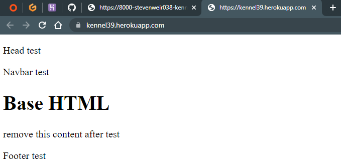
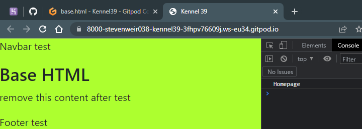
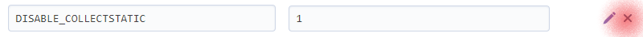
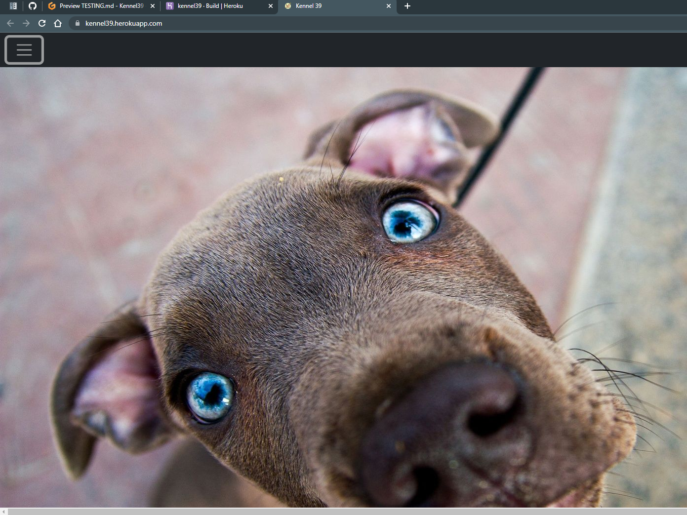
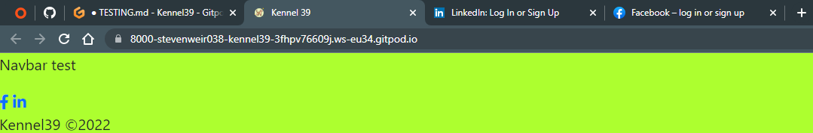

# Testing

A variety of manual and automated tests were performed throughout the project.

## Manual Testing

**#1. Getting the live deployed site working**

This is well documented in the latter sections of [DEPLOYMENT.md](DEPLOYMENT.md)

**#2. Checking the deployed site opens on the homepage**

- create a function based view in home
- create a path in the url file in the home app
- reference the home app url in the main project url file

*home/views.py*
``` Python
def index(request):
    """
    Index view
    """
    return render(request, 'home/index.html')
```
*home/urls.py*
``` Python
path('', views.index, name='index'),
```
*main/urls.py*
``` Python
path('', include('home.urls'), name='home_index'),
```



**#3. Check own `css` and `js` files link up to `base.html` via `head.html` and `scripts.html`**

These are component files that get inserted to `base.html` using Django Templates.


*static/css/style.css*
``` css
- body {
    background-color: greenyellow;
}
```

*referenced in templates/includes/head.html*
``` html
<link rel="stylesheet" href="" type="text/css">
```

*injected into base.html using*
``` Python
    
```


*static/js/script.js*
``` Javascript
console.log("Homepage")
```

*referenced into templates/includes/scripts.html*
``` html
<script src=""></script>
```

*injected to base.html using*
```html

```

The test is successful as the `body` has a greenyellow background colour and `Homepage` text is logged to the console in Chrome.




**#4. Getting the favicon to display on the browser tab**

In the plate above you'll also notice a favicon present.  The test was successful as you can see it.

*templates/includes/head.html*
``` html
<link rel="icon" href="" type="image/x-icon" sizes="32x32">
```

**#5. Checking static folder is working on deployed site**

Any images stored in `static/img/` folder should display when deployed.  Remember to delete the DISABLE_COLLECTSTATIC config var in Heroku Settings by clicking on the X.



When I did deleted this config var and tried to redeploy, the build log stated `python manage.py collectstatic --noinput`.

This prompted a different approach to handling static files by installing the [`dotenv`](https://pypi.org/project/python-dotenv/) python package.  From there i updated the `requirements.txt` file and `settings.py` and `env.py` files in the project before pushing to GitHub again.



Success. The hero image from the static folder now works on the deployed site resolving [issue #25](https://github.com/StevenWeir038/Kennel39/projects/2#card-78901276) in GitHub.

**#6. Ensure social media links in footer open in a new browser tab**

These are generic for the project.  No social content exists as the business does not exist.



**#7. Check index.html template is using base.html template**

Extend `base.html` content to any view by using `` at the top of each file.  Best to test this on the site landing page as this is the first one that is created.

*home/templates/home/index.html*
``` html




<h1>Homepage</h1>  <!-- unique content -->

```

Note, the `home` app urls are already linked up to `main` urls as checked in **#2**.


*templates/base.html*
``` html
    <p>base.html</p>  <!-- remove after demo for TESTING.md -->

    
    <!-- content goes here -->
    
```

The base.html text originates from the `base.html` file.
The h1 heading containing text *Homepage* only exists in `index.html`.


**#8** Correct `settings.py` and `.env` file setup.
After resolving [issue #25](https://github.com/StevenWeir038/Kennel39/projects/2#card-78901276), i found I lost my database connection when working in the the development ennvironment.  Great learning exercise on setting up enviroinment variables and referencing them corrrectly.

## Automated Testing

Return to [README.md](README.md)