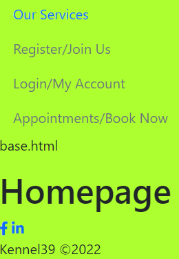

# Testing

A variety of exploratory tests were performed throughout the project.

## Manual Testing

### Setting up Django project
This was a first time use of Django so some testing was performed to cement knowledge.

**1. Getting the live deployed site working**

This is well documented in the latter sections of [DEPLOYMENT.md](DEPLOYMENT.md)

**2. Checking the deployed site opens on the homepage**

- create a function based view in home
- create a path in the url file in the home app
- reference the home app url in the main project url file

*home/views.py*
``` Python
def index(request):
    """
    Index view
    """
    return render(request, 'home/index.html')
```
*home/urls.py*
``` Python
path('', views.index, name='index'),
```
*main/urls.py*
``` Python
path('', include('home.urls'), name='home_index'),
```


**3. Check own `css` and `js` files link up to `base.html` via `head.html` and `scripts.html`**

These are component files that get inserted to `base.html` using Django Templates.


*static/css/style.css*
``` css
- body {
    background-color: greenyellow;
}
```

*referenced in templates/includes/head.html*
``` html
<link rel="stylesheet" href="" type="text/css">
```

*injected into base.html using*
``` Python
    
```


*static/js/script.js*
``` Javascript
console.log("Homepage")
```

*referenced into templates/includes/scripts.html*
``` html
<script src=""></script>
```

*injected to base.html using*
```html

```

The test is successful as the `body` has a greenyellow background colour and `Homepage` text is logged to the console in Chrome.


**4. Getting the favicon to display on the browser tab**

In the plate above you'll also notice a favicon present.  The test was successful as you can see it.

*templates/includes/head.html*
``` html
<link rel="icon" href="" type="image/x-icon" sizes="32x32">
```

**5. Checking static folder is working on deployed site**

Any images stored in `static/img/` folder should display when deployed.  Remember to delete the DISABLE_COLLECTSTATIC config var in Heroku Settings by clicking on the X.


When I did deleted this config var and tried to redeploy, the build log stated `python manage.py collectstatic --noinput`.

This prompted a different approach to handling static files by installing the [`dotenv`](https://pypi.org/project/python-dotenv/) python package.  From there i updated the `requirements.txt` file and `settings.py` and `env.py` files in the project before pushing to GitHub again.


Success. The hero image from the static folder now works on the deployed site resolving [issue #25](https://github.com/StevenWeir038/Kennel39/projects/2#card-78901276) in GitHub.

**6. Ensure social media links in footer open in a new browser tab**

These are generic for the project.  No social content exists as the business does not exist.


**7. Check index.html template is using base.html template**

Extend `base.html` content to any view by using `` at the top of each file.  Best to test this on the site landing page as this is the first one that is created.

*home/templates/home/index.html*
``` html




<h1>Homepage</h1>  <!-- unique content -->

```

Note, the `home` app urls are already linked up to `main` urls as checked in **#2**.


*templates/base.html*
``` html
    <p>base.html</p>  <!-- remove after demo for TESTING.md -->

    
    <!-- content goes here -->
    
```

The base.html text originates from the `base.html` file.
The h1 heading containing text *Homepage* only exists in `index.html`.



**8 Correct `settings.py` and `.env` file setup.**
After resolving [issue #25](https://github.com/StevenWeir038/Kennel39/projects/2#card-78901276), I found I lost my database connection when working in the development environment.  Great learning exercise on setting up [environment variables](https://github.com/StevenWeir038/Kennel39/commit/a55b3abca2dbb5fe24304ec0273901f3c7c34ccd) correctly.

**9 Check `allauth` working with nav links.**
Allauth did the hard work for signup/login/logout.  Just had to configure `navbar.html` with Django templates to check authentication. 

A test account was created to check it worked.

``` html
<ul class="navbar-nav justify-content-end flex-grow-1 pe-3">
    <li class="nav-item">
    <a class="nav-link active" aria-current="page" href="#">Home</a>
    </li>
    <li class="nav-item">
    <a class="nav-link" href="#">Our Services</a>
    </li>
    
    <li class="nav-item">
    <a class="nav-link" href="">Logout</a>
    </li>
    <li class="nav-item">
    <a class="nav-link" href="#">Book Appointment</a>
    </li>
    
    <li class="nav-item">
    <a class="nav-link" href="">Register</a>
    </li>
    <li class="nav-item">
    <a class="nav-link" href="">Login</a>
    </li>
    
</ul>
```

*Unregistered/Logged out menu*


*Login page*


*Registered/Logged in menu*


*Logout page*


*Proof of Registration in site admin*


**10 Check 1st model has successfully migrated. (same checks to be applied to all subsequent models after creation or update)**

In CLI, type `python3 manage.py makemigrations --dry-run` to view unexecuted effect. This tells Django to create instructions that build a new database table in the `home` app.

Remove the ` --dry-run` flag to perform the action.

Use the `python3 manage.py showmigrations` command to see a list of existing migrations.  The absence of an `X` in the home app 0001_initial tells us we have yet to migrate this particular model to build the database table in the backend.


To create the database table in the backend type `python3 manage.py migrate` into the terminal. Similar to the --dry-run tag in makemigrations, the ` --plan` flag can be used to preview the effects of migrating before applying.


To reiterate, `makemigrations` are the instructions to build a table, the `migrate` command actually to builds it. 

It is now possible to create profiles programatically though I wanted to test with the Django admin utility.

To do so the model must be registered within the apps `admin` file.

``` python
from django.contrib import admin

from .models import Profile  # from current directory model file import Profile model

# Register your models here
admin.site.register(Profile)
```

In Django admin, the `OneToOneField` is shown to work as users can be selected from the dropdown list.  Remember how these users were created using `Allauth`...


Next problem, *Profile* is a different table to *User*.  How do I get *Profile* to update each time a *User* is created/updated.

Answer, define signals and make new methods for when a save event occurs.  So, in the models file import `post_save` and `reciever` as below.

Review [Vitor Freitas](https://simpleisbetterthancomplex.com/tutorial/2016/07/22/how-to-extend-django-user-model.html#onetoone) blog.  Work on this issue is incomplete.

2 extra methods are required when creating and updating.

The standard signup form will need two additional fields to accomodate phone and address fields in the linked Profile table. Upon correct setup the Profile fields should automatically update.

Revised location of *Profile* as this isn't related to the *home* app.  Created another app called *profiles* and put the model there before updating forms.

To fix this oversite I deleted the postgres table from the CLI by typing:

- `python manage.py dbshell` to access postgres
- `\dt` to display a list of tables
- `DROP TABLE home_profile` to remove the table from the database
- `\dt` to check *home_profile* was removed
- created a new app called *profiles* and added it to *settings* installed apps, created the model in that directory and registered with admin.

Thanks to [Tutorials Point](https://www.tutorialspoint.com/python_data_access/python_postgresql_drop_table.htm) for the guidance.

**11 Extend allauth signup to include request for phone and address fields set up in Profile table. (This table has a one to one link to default allauth User)**

Still to resolve issue [#28](https://github.com/StevenWeir038/Kennel39/issues/28) 

**#12 Booking Model update**

As mentioned in the AGILE file the original `booking` model was too simple.  Appointments needed to:

-  be restricted to 8am-5pm business hours, not in the middle of the night!
-  be standardised to specific time and duration.  Ie. 45 minutes from 8am to 4pm.  9 hour day with 15 minute interlude between appointments.

``` python
class Booking(models.Model):
    """
    Booking model
    """

    class AppointmentTime(datetime.time, models.Choices):
        """
        Subclass appointment times for start_time field
        """
        AM_0800 = 8, 0, 0, '08:00'
        AM_0900 = 9, 0, 0, '09:00'
        ...

    start_time = models.TimeField(choices=AppointmentTime.choices, null=False, blank=False, default=AppointmentTime.AM_0800)
    ...
```

Be subclassing a list within the booking model I was able to use a time format for the appointments though this doesn't allow the `timedelta` method to be used to calcuate duration. I'll be wary of this approach in future projects.

**13 Registration Errno 111**
I encountered this late into the project.  A new account was registered but an error was thrown as an email couldn't be sent.
After reviewing Django [Allauth docs](https://django-allauth.readthedocs.io/en/latest/configuration.html), the solution was to disable `email verification`.


1


``` python
ACCOUNT_EMAIL_VERIFICATION = 'none'
```

## Exploratory tests

### Site navigation
| Checked | When not logged in, the nav menu can direct a user to the |
|:-------:|:--------------------------------------------------------- |
| &check; | services page |
| &check; | registration page |
| &check; | logon page |

| Checked | When logged in, the nav menu can direct a user to the |
|:-------:|:----------------------------------------------------- |
| &check; | services page |
| &check; | logout page |
| &check; | book appointment page |

### Landing page CTA buttons
| Checked | When not logged in, CTA buttons on the landing page can direct a user to |
|:-------:|:-------------------------------------------------------------------------|
| &check; | services page |
| &check; | registration page |
| &check; | logon page |

| Checked | When logged in, CTA buttons on the landing page can direct a user to |
|:-------:|:---------------------------------------------------------------------|
| &check; | services page |
| &check; | book appointment page |

### Accounts & site access
| Checked | Registration, login and logout |
|:-------:|:-------------------------------|
| &check; | A user can register a new account |
| &check; | Can login after being registered |
| &check; | logout when logged in |

### Services page
| Checked | When not logged in |
|:-------:|:-------------------|
| &check; | A user has options to register or login beneath services descriptions |

| Checked | When logged in |
|:-------:|:---------------|
| &check; | A user has options to book an appointment beneath services descriptions |

### Jquery datepicker
| Checked | datepicker behaviour |
|:-------:|:---------------------|
| &check; | can only select dates from current date to 365 days in advance |

### Bookings management
### Booking table
| Checked | view booking table behaviours |
|:-------:|:------------------------------|
| &check; | `Book now` button directs users to create booking template |
| &check; | Filter is applied to table when a valid date is selected |
| &check; | `Show all` button removes filter and restores view of all table records |
| &check; | `My Bookings` button filters table records by currently logged in user |

### Functionality for all users:
| Checked | all users can |
|:-------:|:--------------|
| &check; | create their own bookings |
| &check; | view own bookings |
| &check; | edit own bookings |
| &check; | cancel own bookings |
| &check; | prevent booking overlaps when creating booking |
| &cross; | prevent booking overlaps when editing booking |

### Functionality for superusers:
| Checked | superusers can |
|:-------:|:---------------|
| &check; | view other users bookings |
| &check; | edit other users bookings |
| &check; | cancel other users bookings |

### Functionality for standard users:
| Checked | standard users must only be able to view a |
|:-------:|:-------------------------------------------|
| &check; | `*****` placeholder instead of another users names to protect privacy |

### Messages:
| Checked | colour coded messages displayed in header when (red=fail, green=success) |
|:-------:|:-------------------------------------------------------------------------|
| &cross; | a new user registers with the site |
| &check; | a user logs onto the site |
| &check; | a user logs out of the site |
| &check; | a new booking has been successfully made |
| &check; | a new booking has been unsuccessfully made |
| &check; | a booking has been successfully edited |
| &check; | a booking has been unsuccessfully edited |
| &check; | alerts are dismissible |

## Automated Testing
A major drawback of exploratory testing was having to repeat it when new code was written. The site is small so the task is manageable but unit testing is the next logical step.

In one example, I was unable to create a booking after trying to update the view to prevent clashes with existing appointments.  (Accidently commented out `form.instance.user = user`) when debugging.

Time to attempt at least a few basic tests for the site.

After writing a few tests it is useful to install the `coverage` module.  This shows what percentage of the code has been tested.

Type `pip3 install coverage`.

To see how much has be tested in the booking app for instance, type `coverage run --source=bookings manage.py test` into the cli.


## Validation


### HTML Validation
[W3C Markup Validator](https://validator.w3.org/)

**1** warnings, **0** errors.


Issue 2 resolved by changing semantic markup in base.html file from `<section>` to `<main>`.

### CSS Validation
[Jigsaw](https://jigsaw.w3.org/css-validator/)

**377** warnings, **6** errors all related to [font awesome](https://cdnjs.cloudflare.com/ajax/libs/font-awesome/6.0.0/css/all.min.css) third party.


### JS Validation
[JSHint](https://jshint.com/)

**0** warnings, **0** errors.


### Python Validation
[PEP8](http://pep8online.com/)

Tool was useful for removing lines > 79 characters, particulary when working with multiline f strings. 

**0** warnings, **0** errors.

#### services/views.py

**0** warnings, **0** errors.


#### views/views.py


### Lighthouse

#### Home page


#### Services page


#### View booking page


## Unresolved Issues

1. HTML5 date input does not disable for weekends.  A Javascript solution is needed to prevent an appointment being created/edited for a Saturday or Sunday when the business is closed.

2. Issue #28 - Extend allauth signup to include request for phone and address fields set up in Profile table. (This table has a one to one link to default allauth User.  This solution is a prerequsite to #8, #9, #10, #11

3. User Story - #8 As a logged in user I can view a page so that I can see my personal account details by individual field 
4. User story - #9 As a logged in user I can click a button so that I can change my personal account details by individual field
5. User Story - #10 As a logged in user I can click a button so that I can delete my account
6. User Story - #11 As a logged in user I can request an email so that I can reset my account password if I have forgotten it
7. User Story - #15 As a logged in user I can request an email so that be reminded of an appointment.  COULD HAVE item.

Return to [README.md](README.md)